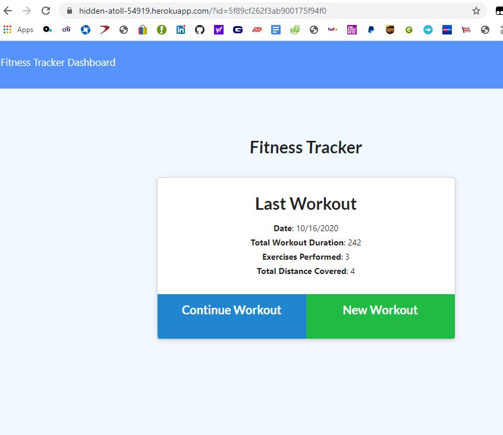

# Title : fitnes-tracker

## Description
Author: Jivko Atanassov

this app is an absolute nessessity in the present hidemand high speed way of life. Tracking of the exersises one does or does not each day is extremely vital to our well being . Only after several days of meticulous tracking I was able to deduct that I actually do not do any exercises at all. Was it not for the fitness tracker app, this would have been unnoticed by my otherwise very perceptive personality. So without further adou here is the "fitnes-tracker".

Github User name: zhim57

## Table of Contents:
- [Title](#title)
- [Description](#description)
- [Table of Contents](#table-of-contents)
- [Installation](#installation)
- [Usage](#usage)
- [License](#licence)
- [Contributing](#contributing)
- [Tests](#tests)
- [Questions](#questions)

## Installation
npm init -y, npm install, node server from the main directory, or just press the heroku link
## Usage
- Web development/front end
- Node.js  application
- Web development back end
- Database Application
- Productivity Application
- iOS App
- Android app
- entertainment application
- Financial App
- transportation application
- other
Yes tracking is paramount to exercizing and without exercizing we die , so please start tracking , and hopefully start exercizing...in other words this app saves lives!
## Email
zhim57@yahoo.com
## Contributing
The main code was given to me ready from the good coders of the bootcamp, for the route files I used the knowledge and experience of my instructors and colleagues from the bootcamp . Herocu and Github gave the environment for soring and deploying the app.... it is a team excersise ....
## License

## Tests
practical usage tests....

## Questions
please email Jivko Atanassov with any questions at: zhim57@yahoo.com. Thank You.

## Links

[link to this portfolio](https://github.com/zhim57/fitnes-tracker)

[link to the deployed application](https://hidden-atoll-54919.herokuapp.com/?id=5f89cf262f3ab900175f94f0)
  

## Screenshots

  
